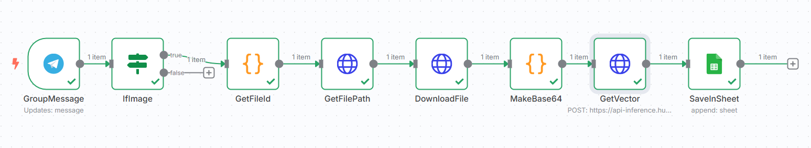

#  automation-portfolio

> A curated collection of advanced automation workflows built with **n8n**, integrating LLMs, APIs, and third-party services to solve real business tasks.  
> Each project is fully functional, production-tested, and reflects my capabilities as a **Developer**, **Architect**, and **Integration Specialist**.

---

##  Featured Projects

### 🔹 Loans AI Consultant

**Description:**  
An advanced AI automation built for a regional lending platform. It acts as a virtual loan advisor: analyzes user preferences, matches them with the best loan offers, sends clickable application links, tracks user activity, performs multi-stage follow-ups, pushes a regularly updated offer showcase, refreshes the database daily, and compiles client reports for managers.

**Technologies used:**  
GPT-4o Mini, GPT-4.1 Nano, Telegram Bot API, MySQL (Dockerized), JavaScript, Google Sheets, Vector Embeddings, Python, Docer, n8n Scheduler

**Status:**  
 Completed (Code under NDA, not available)

**Workflow Overview:**  
The full architecture includes:
- Dynamic GPT-based prompt routing
- Preference extraction and classification
- Offer matching engine
- Click tracking and engagement logging
- Scheduled follow-up sequences
- Cron-based daily updates
- Daily performance report delivery

**Visual Workflow Snapshot:**  
*(Sanitized schema – details hidden due to NDA)*  

---
###  🔹 Telegram Image Embeddings Bot

**Description:**  
A Telegram bot that automatically processes images sent in a group chat, extracts their embeddings using OpenCLIP, and logs them to a Google Sheet with message metadata. Built and deployed using **n8n**, this bot enables scalable image vectorization for later semantic search or ML analysis.

**Technologies used:**  
n8n, Telegram Bot API, Google Sheets API, OpenCLIP (via HuggingFace API), Base64 encoding, JavaScript, .env

**Status:**  
 Public — source code available

 [View code](./Telegram-Image-Embeddings-Bot)

 Screenshot:  

---

##  About Me

**Name:** webmixgamer  
**Role:** Automation Developer | AI Workflow Architect  
**Contact:** Available upon request

---

## ⏳ Coming Soon

Additional projects will be added to this repository soon.
