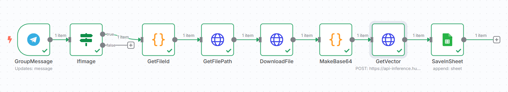

# 🖼 Telegram Bot for Extracting Image Embeddings

This bot listens to a specific Telegram group and automatically processes incoming images. It converts them to base64, sends them to an OpenCLIP model via API, and logs the resulting vector embeddings into a Google Sheet, along with Telegram metadata.

---

## ✅ Features

- Listens for image messages in a Telegram group
- Downloads the image and converts to Base64
- Sends image to OpenCLIP model API and retrieves embeddings
- Stores the vector, message ID, and timestamp in Google Sheets
- Built on n8n with reliable modular workflow

---

## 🧠 Tech Stack

- **n8n**
- **Telegram Bot API**
- **Google Sheets API**
- **OpenCLIP / HuggingFace Inference API**
- JavaScript / JSON
- `.env` for secret keys

---

## 🚀 Setup

1. Clone this repository
2. Create `.env` file using `.env.example`
3. Fill in your API keys:
   - Telegram Bot Token
   - HuggingFace API key (or your inference endpoint)
4. Import `workflow.json` into your n8n instance
5. Run and monitor in n8n UI

---

## 📦 Folder Structure

Telegram-Image-Embeddings-Bot/
├── assets/ ← workflow screenshot
├── workflow.json ← main n8n export
├── .env.example ← sample environment config
└── README.md ← this file

## 🖼 Workflow

---

## 🔐 Notes on Security

- API tokens are stored in `.env`
- Do not commit `.env` to Git
- Sensitive data is filtered in logs

---

## 👤 Author

Created by [webmixgamer](https://github.com/webmixgamer)
